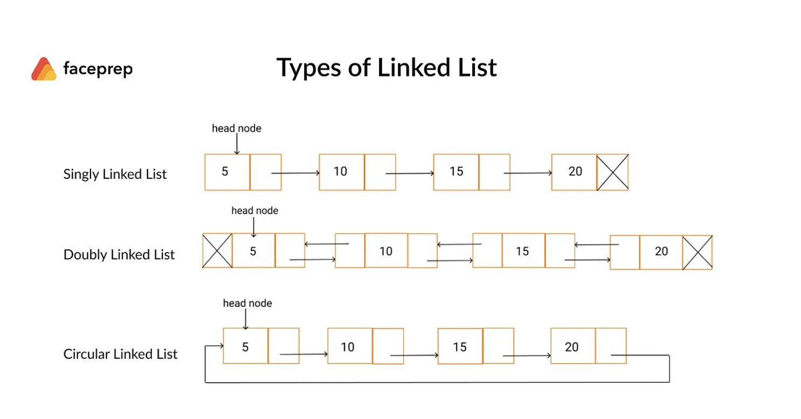

### Linked List

### Overview

A linked list is a linear data structure where each element (called a "node") is connected to the next one via a pointer. Unlike arrays, linked lists do not store elements in contiguous memory locations.

### Key Components
1 Node: The basic building block of a linked list. Each node contains:
 + Data: The value stored in the node.
 + Next Pointer: A reference to the next node in the list.

2 Head: The first node in the linked list.

3 Tail (optional): The last node in the list, typically pointing to null.

### Operations
**1 Insertion:**
+ At the beginning
+ At the end
+ At a specific position

**2 Deletion:**
 + From the beginning
 + From the end
 + From a specific position

**3 Traversal:** Visiting each node in the list sequentially.

**4 Search:** Finding a node with a specific value.

### Advantages
**Dynamic Size:** Can grow or shrink as needed.
**Efficient Insertions/Deletions:** Especially at the beginning or middle, as no shifting of elements is required.

### Disadvantages
**Sequential Access:** Traversal is required to access elements
**Extra Memory:** Each node requires additional memory for the pointer(s).

### Use Cases

- Implementation of stacks, queues, and graphs.

- Dynamic memory allocation.

- Undo functionality in text editors.

- Music playlists or image viewers (e.g., next and previous navigation).